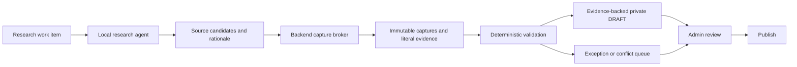

# AI-Native Catalog Turnaround

> Status: Accepted product-direction record.
> Decision date: 2026-08-05.
> Implementation status: The first transition is implemented: an authenticated admin can publish an existing evidence-backed DRAFT without re-entering nutrient values, and publication state is distinct from human verification time. Local-agent discovery and research-run persistence remain the next implementation slices.

## Origin

> 내가 한달동안 109개의 글을 쓰면서 만든 고양이 건사료 데이터베이스를, 왜 아직도 손으로 재조사해야 하는걸까?

Catfood Admin began with this small question.
The operator had already done the expensive work once: finding products, reading labels, comparing sources, normalizing inconsistent nutrition fields, and recording the reasoning across 109 articles in one month.
Requiring the same person to repeat that investigation by hand is not a quality guarantee.
It is a failure to preserve research as executable, inspectable knowledge.

This project is therefore not merely an admin form attached to a catalog.
It is an admin-operated research laboratory and information repository, and it should behave like a small agency whose agents can investigate, preserve evidence, learn from failed attempts, and resume work without repeating it.

## Discovery

The project correctly hardened provenance, source capture, evidence validation, conflict handling, and public-read boundaries.
It then drew an overly broad conclusion from one failed orchestration model.

The rejected autonomous workflow coupled source discovery, retrieval, extraction, model availability, and database writes into one long-running request.
Its poor failure isolation justified removing that implementation.
It did not prove that automatic nutrient research was impossible.

The current source-first workflow proved that research can be decomposed into safer stages.
However, it also encoded the human curator as the only actor allowed to select sources, request extraction, apply evidence, and verify data.
That is a policy choice in the current application, not an inherent requirement of trustworthy nutrition data.

The most important implementation gap is even simpler: the documented workflow says an existing DRAFT can be reviewed and promoted through a validated catalog-write path, but the current application has no supported promotion path for an existing DRAFT.
The perceived manual-input bottleneck is therefore a combination of missing workflow state and conservative authorization policy.

## Turnaround Decision

Catfood Admin will be developed as an AI-native, admin-operated research agency.

The normal research path will allow a local agent to discover candidate sources, propose captures, extract literal evidence, and persist evidence-backed private DRAFT data through a narrowly scoped backend boundary.
The agent will not receive direct database authority or production service-role credentials.
The backend remains responsible for source capture, deterministic validation, privileged writes, and durable audit records.

Public publication will remain an explicit admin approval step during the first transition phase.
The admin should review evidence, conflicts, and exceptions rather than retype values the agent has already grounded in retained source material.
Automatic publication is a later policy decision that requires its own evaluation evidence and publication-state model.

## What Remains Invariant

| Invariant              | Meaning                                                                                                |
| ---------------------- | ------------------------------------------------------------------------------------------------------ |
| Per-field provenance   | Every measured nutrient value identifies the source kind and exact retained source used for it.        |
| Literal evidence       | A proposed value is rejected unless the cited excerpt and numeric value occur in the retained capture. |
| Source integrity       | The backend owns bounded capture, content hashing, current-source identity, and privileged writes.     |
| Conflict preservation  | A newer or overlapping source never silently overwrites a conflicting current value.                   |
| Honest uncertainty     | Missing, ambiguous, estimated, derived, and measured values remain distinct.                           |
| Scoped safety claims   | Safety information states its source, observation date, market, product identity, and limits.          |
| Reproducible decisions | Every accepted, rejected, failed, retried, and superseded research step remains inspectable.           |

Human labor is not an invariant.
Trustworthy provenance is.

## What Is Superseded

The following conclusions are no longer forward-looking product constraints:

- Automatic nutrient collection has been proven impossible.
- A human must discover or approve every source URL before an agent can inspect it.
- Manual transcription is the normal recovery path for image-only or dynamic sources.
- Web research, extraction, and catalog mutation belong in one application request.
- `data_verified_at` can represent human review, publication eligibility, and general verification state without ambiguity.

The historical [Source-First Catalog Collection](../specs/2026-07-15-source-first-catalog-collection.md) decision remains valuable for the trust boundaries it introduced.
Its human-only discovery and automation prohibitions are implementation history, not the target operating model.

## Operating Model

The agent proposes.
The backend proves.
The admin governs publication and resolves exceptions.

This division preserves the strongest work already completed while removing repetitive manual investigation from the normal path.

## Research Ledger Rule

Every research run must preserve enough state to explain what happened and resume without starting over.

At minimum, a run records:

- the work item and product identity under investigation;
- search queries, candidate URLs, and accepted or rejected source rationale;
- captured artifacts, resolved source identity, content hashes, and observation times;
- the agent, model, prompt, tool, and output-schema versions used;
- proposed values, literal excerpts, validation results, conflicts, and gaps;
- retry reason, terminal failure reason, or superseding run;
- admin review, publication decision, and rollback relationship when applicable.

A terminally failed approach may be retried only when the source, assumption, tool, or method has materially changed.
Trial and error is an asset when it is retained as evidence.
It is waste when it is forgotten and repeated.

## Admin-Only Scope

The service currently accumulates information only under the operator's administration.
It does not need public contribution workflows, contributor reputation, community moderation, tenant isolation, or consensus editing before the research loop is useful.

This narrower scope removes unnecessary product machinery.
It does not justify giving an agent unrestricted credentials, because untrusted source content and accidental destructive writes remain relevant inside a single-admin laboratory.

## First Transition Slice

1. Preserve this turnaround in the authoritative product documentation and mark the older source-first policy as historical.
2. Separate human verification time from publication state, verification method, and research-run identity.
3. Add a supported transition that promotes an existing evidence-backed DRAFT without re-entering its nutrient values.
4. Add a minimal machine-principal proposal boundary whose privileged database operations remain inside the backend.
5. Run local-agent discovery and extraction outside the Next.js request path and persist every attempt in the research ledger.
6. Route incomplete identity, inaccessible artifacts, conflicting values, and ambiguous units to an exception queue.

This slice does not require a general workflow engine, a public contributor system, or automatic publication.

## Success Condition

The turnaround succeeds when the admin can select or enqueue a product, allow the agency to perform the routine investigation, inspect the retained evidence and exceptions, and publish without manually repeating the research or retyping supported values.

Every published value must remain traceable to retained source evidence.
Every failed run must make the next run more informed.
Every unresolved gap must remain explicit rather than being filled by confidence or convenience.

## Non-Decisions

- Automatic public publication is not approved by this decision.
- Fully local model inference is not required by this decision.
- Price crawling remains outside the current product scope.
- Public or multi-admin contribution workflows remain outside the current product scope.
- The exact database schema and runner transport will be decided in the implementation specification.

## Relationship to Existing Documents

[BLUEPRINT.md](../../BLUEPRINT.md) is the forward-looking product authority and now reflects this direction.
The [Source-First Catalog Collection](../specs/2026-07-15-source-first-catalog-collection.md) document remains a historical implementation decision and the source of the provenance safeguards that this direction retains.
