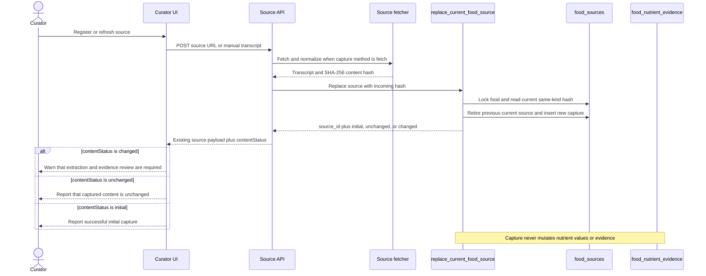

# Content Hash Change Detection

Status: Proposed — awaiting review of the written specification

## Context

Every successful source capture already stores a SHA-256 hash of normalized captured text in `food_sources.content_hash`.
The hash is currently written but never compared, so the curator cannot distinguish an initial capture, repeated content, and changed content.

`content_hash` proves only that two transcripts produce the same normalized text.
It does not prove that nutrient values are equal, that evidence has been reviewed, or that extraction can be skipped.

The capture transaction and evidence-application transaction remain separate boundaries.
Capturing a changed transcript must not overwrite nutrient values or current nutrient evidence.

## Decision

The source replacement transaction compares the incoming hash with the current fetched source for the same `(food_id, kind)` while holding the existing food-row lock.
It returns one explicit content status with the inserted source ID.

| Status      | Condition                                                         | Meaning                                             |
| ----------- | ----------------------------------------------------------------- | --------------------------------------------------- |
| `initial`   | No current fetched source exists for the same food and kind.      | This is the first comparable capture.               |
| `unchanged` | The current source and incoming source have equal content hashes. | The normalized transcript is repeated.              |
| `changed`   | The current source and incoming source have different hashes.     | The normalized transcript changed and needs review. |

The comparison deliberately ignores URL and capture method because the result describes transcript content only.
A new URL with identical normalized text is therefore `unchanged`, while the ledger still records the new source provenance.

Every successful capture remains a retained ledger entry and becomes the current source through the existing atomic replacement transaction.
Retiring the previous row changes only its `is_current` lifecycle flag, preserving its captured text, hash, capture time, URL, and observation date without introducing a second attempt table.

Existing nutrient values and `food_nutrient_evidence` rows are never changed by content-hash comparison.
If a curator extracts the new capture, `apply_food_evidence_draft` continues to decide whether each candidate is `applied`, `skipped`, or `conflict`.

## Data Flow



## Database Contract

A new migration redefines `replace_current_food_source`; previously applied migrations remain unchanged.

The RPC:

1. Validates the source input using the existing rules.
2. Locks the target food row.
3. Reads the current fetched source hash for the same food and kind.
4. Derives `initial`, `unchanged`, or `changed`.
5. Retires the current source, inserts the new capture, and updates the food compatibility URL in the same transaction.
6. Returns exactly one result containing `source_id` and `content_status`.

The function remains `SECURITY DEFINER` with an empty `search_path`, fully qualified relations, and execution granted only to `service_role`.
No RLS policy is relaxed.

The generated Supabase TypeScript definitions are regenerated from the linked schema after applying the migration.
They are not edited manually.

## API and UI Contract

The source registration response preserves the existing `source` object and adds `contentStatus`.

```typescript
type ContentStatus = "initial" | "unchanged" | "changed";

type SourceCaptureResponse = {
  readonly contentStatus: ContentStatus;
  readonly source: {
    readonly capturedAt: string;
    readonly capturedText: string;
    readonly contentHash: string;
    readonly id: number;
    readonly kind: "manufacturer" | "kr_label";
    readonly observedAt: string | null;
    readonly url: string;
  };
};
```

The client parses this response before clearing curator input.
An invalid success payload is treated as an application error rather than silently accepted.

The curator sees:

- `initial`: a normal source-capture success message.
- `unchanged`: a message that the source content matches the previous capture.
- `changed`: a warning that the source content changed and extraction and evidence review are required.

A failed HTTP capture continues to return the existing `422` response with a failed ledger row.
It does not receive a content status because no transcript hash exists.

## Error Handling

Hash comparison and source replacement are one database transaction.
If status derivation, source retirement, source insertion, or compatibility URL update fails, the previous current source and compatibility URL remain unchanged.

The repository rejects a missing or malformed RPC result with `SourceRepositoryError`.
The API returns its existing generic source-registration failure response for unexpected repository errors.

## TDD and Verification

Implementation follows RED, GREEN, and REFACTOR in this order.

### RED

- Extend the source replacement pgTAP contract so the existing RPC fails expectations for `initial`, `unchanged`, and `changed`.
- Add a TypeScript response-contract test that fails because the three statuses are not yet parsed.
- Confirm each test fails for the missing behavior rather than test setup or connectivity.

### GREEN

- Add the smallest RPC return contract and hash comparison needed to satisfy the database tests.
- Parse the generated RPC result in the repository.
- Add `contentStatus` to the API response and display the corresponding curator message.

### REFACTOR

- Remove duplicate response construction only if the new status makes the existing two capture branches materially harder to keep consistent.
- Do not introduce a general source-state abstraction or persistent review workflow.

### Verification

- Run the new pgTAP contract against the linked project and force a final-write failure to prove rollback.
- Re-run the existing source refresh provenance and publication RLS pgTAP contracts.
- Regenerate `src/types/supabase.d.ts` from the linked schema.
- Run typecheck, lint, all Vitest tests, knip, Trunk, production build, and linked database lint.
- Exercise one unchanged and one changed capture through the curator surface when an authenticated browser session is available.

## Out of Scope

- Treating equal hashes as a database no-op or deduplicating capture rows.
- Skipping extraction or reusing model output based only on `content_hash`.
- Adding an extraction or prompt pipeline version.
- Persisting a `review_status`, `reviewed_at`, or source-refresh queue.
- Automatically changing nutrient values or current evidence during capture.
- Implementing the deferred transcript viewer, failed-source list, or DRAFT search.

## Acceptance Criteria

- Initial, repeated, and changed normalized transcripts produce `initial`, `unchanged`, and `changed` respectively.
- Every successful capture remains recorded and source replacement stays atomic.
- The API returns the status that the database derived.
- The curator receives a visible warning for changed content and a non-warning result for unchanged content.
- Content-hash comparison never changes nutrient values or nutrient evidence.
- `anon` and `authenticated` cannot execute the replacement RPC.
- Existing provenance, RLS, and source-replacement regression tests continue to pass.
